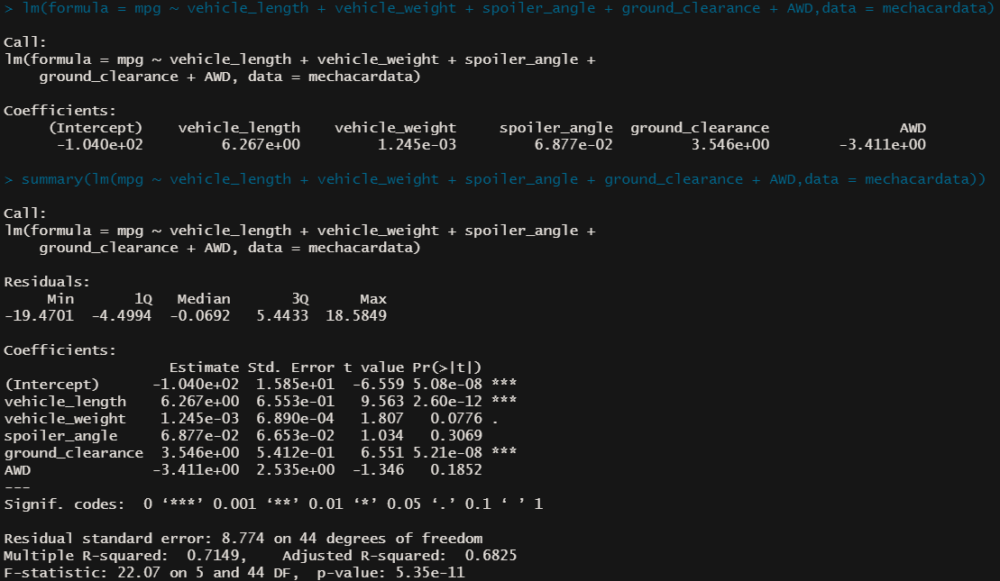
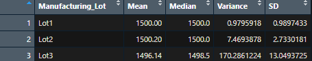
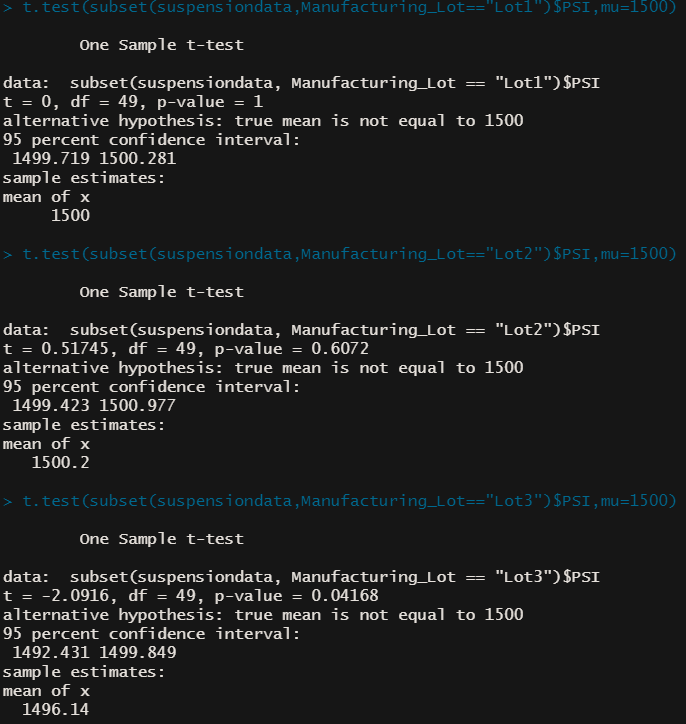

# MechaCar Statistical Analysis

## Linear Regression to Predict MPG

- **Vehicle length** and **ground clearance** (as well as the intercept value) provide the most significant non-random amount of variance to Miles Per Gallon (mpg). The p-value for vehicle_length is 2.60e-12 and the p-value for ground_clearance is 5.21e-08. The slope is not equal to zero as the p-value is 5.35e-11. The linear model is sufficient with an r-squared value of .7149, or a 71% accuracy rate. 

## Summary Statistics on Suspension Coils

- The variance is under 100 at 62.3 (shown below), meaning that overall the manufacturing data meets the design requirements of 100 PSI variance. Investigating further, the lot summary shows that lot 3 a variance of 170. Lot 1 and lot 2 both are within the required PSI variance.

## T-Tests on Suspension Coils

## Study Design: MechaCar vs Competition

