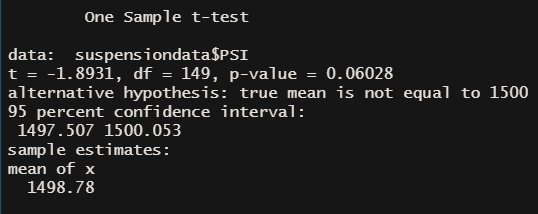

# MechaCar Statistical Analysis

## Linear Regression to Predict MPG

- **Vehicle length** and **ground clearance** (as well as the intercept value) provide the most significant non-random amount of variance to Miles Per Gallon (mpg). The p-value for vehicle_length is 2.60e-12 and the p-value for ground_clearance is 5.21e-08. The slope is not equal to zero as the p-value is 5.35e-11. The linear model is sufficient with an r-squared value of .7149, or a 71% accuracy rate. 

## Summary Statistics on Suspension Coils

- The variance is under 100 at 62.3 (shown below), meaning that overall the manufacturing data meets the design requirements of 100 PSI variance. Investigating further, the lot summary shows that lot 3 a variance of 170. Lot 1 and lot 2 both are within the required PSI variance.

## T-Tests on Suspension Coils

- Using a t-test to compare PSI across **all manufacturing lots** showed that the suspension coils were not statistically different. This is evident by the .06028 p-value was not low enough to reject the null hypothesis.
- Using a t-test to compare PSI across **manufacturing lot 1** showed that the suspension coils were not statistically different. This is evident by the 1.0 p-value was not low enough to reject the null hypothesis.
- Using a t-test to compare PSI across **manufacturing lot 2** showed that the suspension coils were not statistically different. This is evident by the .0672 p-value was not low enough to reject the null hypothesis.
- Using a t-test to compare PSI across **manufacturing lot 3** showed that the suspension coils was a slight statistically difference. This is evident by the .04168 p-value was low enough to reject the null hypothesis.

## Study Design: MechaCar vs Competition

### Metrics 
This study compared the **amount of cupholders** the MechaCar has in comparison to the competition. While a simple metric, it has the potential to be of great interest to consumers. 

### Alternative Hypothesis
MechaCar's average amount of cupholders are statistically greater or less than competitor vehicles.

### Statistical Testing
The ideal test would be a two-sample t-test. Sampling a competitors cupholder average compared to MechaCar's cupholder average.

### Data Needed
The count of cupholders of each model for MechaCar and competitors, alike.
